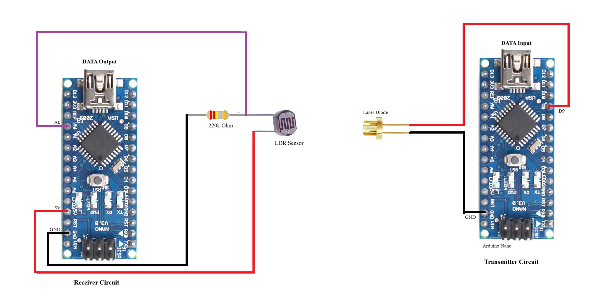

# Simulation of Quantum-Inspired Encrypted Data Transmission Over Li-Fi Using Arduino Nano and Python

A Python-Arduino based Li-Fi communication system simulating quantum encryption using Base64 and XOR over visible light. It uses libraries 

## Circuit Diagram




## Requirements
- Python 3.x
- Tkinter library
- Pyserial library
- base64 library

```bash
python -m pip install --upgrade pip && python -m pip install pyserial
```

## Collaborators

- [Govind Sankar](https://github.com/Govind-Sankar)
- [Sanidhya Sharma](https://github.com/Sanidhyadamned)
- [Noel Ann Roy](https://github.com/N2006AR)
- [Muhammad Hanan Sajid](https://github.com/MdHananSjd)
- [Aditi Singh](https://github.com/okaditi)
- [Alvin Binoy Manicheril](https://github.com/Alvin-binoy)
- [S Sanjay](https://github.com/Sanjay-5406)
- [N L Lalith Raghavendra](https://github.com/Ltechindustries)


## License

This project is licensed under the [MIT License](LICENSE).

Feel free to use, modify, and distribute it. See the LICENSE file for details.
